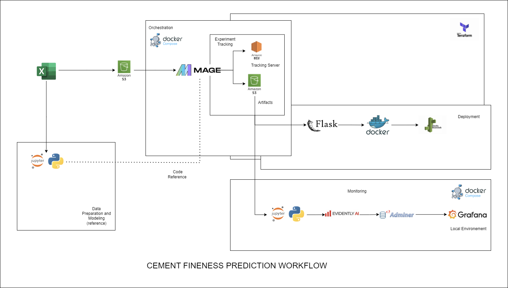

# Cement Fineness Prediction

This is the final  project for the DTC MLOps Zoomcamp. This is an end to end project that covers all the topics discussed in the course. This includes modeling, experiment tracking, orchestration, deployment, monitoring and different best practices. 

### Problem Description 

In the field of building materials, cement fineness is an important the parameter since it significantly affects various properties and performance characteristics of the final product. One of the primary impacts of cement fineness is on the rate of hydration. Finer cement particles have a larger surface area in contact with water, which accelerates the chemical reactions involved in the hydration process. This leads to faster development of strength in the cement, making it possible to achieve higher early strength in concrete structures.

### Project Objective

The objective of this project is to build an end to end project that predicts cement fineness based on the operational parameters in a cement manufacturing plant. These parameters include temperature, pressure ,feedrate and current consumption of different equipment that constitutes the part of the process necessary for making cement.The dataset for this project were gathered from a control system's database and due to security issues and concerns the file was extracted as an xlsx file and was saved in an AWS S3 bucket. 

### Project Architecture 



### Project Tools and Technology
* Experiment Tracking and Model Registry: MLFlow
* Workflow Ochestration: MageAI and Prefect (Montoring)
* Cloud: Amazon Web Service (AWS) - S3(Model Registry), ElasticBeanstalk(Deployment) , EC2(Experiment Tracking)
* Containerization tools: Docker, Docker Compose
* Dependency Management: Pipenv and Conda Envrironment 
* Containerization tools: Docker, Docker Compose
* Model Deployment: Docker container using Flask Framework 
* Code Repository: Github
* Best Practices:
    * Testing 
        * unit-testing (pytest)
        * integration-testing (docker-compose)
        * linting (pylint)
        * formatting (isort, black)
        * pre-commit (black, isort, pytest)
        * Makefiles 
        * CI/CD Pipeline: Github Actions
* Infrastructure as Code (IAC): Terraform


### Project Workflow
 
The project started by performing Data Preparation to Data Modeling in Jupyter Notebook. The dataset was stored in an S3 bucket as an xlsx file. The experiment done on the notebook was later implemented in Mage AI for orchestation that also incorporates experiment tracking and model registry. The model registry was then kept in a seperate S3 
bucket for further use in the deployment phase.

To run or test the project, one needs to have an AWS account with which the IAM role is configured. The following permissions needs to be given:

After the AWS account has been prepared, install AWS CLI  [link](https://docs.aws.amazon.com/cli/latest/userguide/getting-started-install.html). Configure the access keys by in  your local environment. Run the following commands and input the necessary details found in your access key file 

 ```bash
aws configure
```

To see how data was prepared and then modeled, please see the notebook CementFinenessProject.ipynb . To test run, install the requirements.txt in a conda environment using the following commands.


 ```bash
conda env create -n env_name python=3.10 
conda activate env_name
pip install -r requirements.txt
jupyter notebook
```

The local dataset was also provided in the data folder for reference. To clone the repo run the following command:

Navigate to the testing folder upon cloning and run 


 ```bash
cd testing
make setup
```


To be able to see the whole cloud infrastructure please refer to the Infrastructure section. To re create the whole cloud envrionement, install terraform [link](https://developer.hashicorp.com/terraform/install). Run the following commands 

 ```bash
cd infrastructure
terraform init
terraform plan
terraform apply
```
For orchestration, Mage AI was used. The dataset was uploaded in an S3 bucket that will be fetched through Mage. The dataset was also similar to what was found in the local data folder. The file was saved as an xlsx file due to some security reasons and that direct access to the database was prohibited. To see the orchestration workflow, go to the local folder orchestration and run docker compose. Access MageAI using http://localhost:6789/

To install docker compose, follow the provided instructions in the DTC MLOPS Zoomcamp intro [link](https://github.com/DataTalksClub/mlops-zoomcamp/tree/main/01-intro)

Set the AWS_ACCESS_KEY_ID and AWS_SECRET_ACESS_KEY as environment variable in the Mage environmment before executing the pipeline. Remember to upload the dataset in the created S3 bucket. The AWS EC2 setup must also be done and the following video can be used as a reference to run the EC2 as an Mlflow tracking server. [link](https://youtu.be/XEZ7Hx2NrO8?si=mNlwQ4xgEFWWebBy)


For the deployment , two options were given as seen on the deployment folder- predict.py file .
1. The local model found in the folder 
2. The model that was saved in the S3 bucket 

Install pipenv using the following commands 

 ```bash
cd deployment
pipenv install
pipenv shell
```
Build the docker image and run locally

 ```bash
docker build -t fineness-prediction-service:v1 .
```
To run locally using option 1 
 ```bash
docker run -it --rm -p 9696:9696 fineness-prediction-service:v1
```

To run using option 2

 ```bash
docker run -it --env-file=./.env --rm -p 9696:9696 fineness-prediction-service:v1
```
or 

 ```bash
docker run -it -v $HOME/.aws/credentials:/root/.aws/credentials:ro --rm -p 9696:9696 fineness-prediction-service:v1
```


To deploy in elastic beanstalk , install the aws eb cli by using the [link](https://docs.aws.amazon.com/elasticbeanstalk/latest/dg/eb-cli3-install.html).
Execute the following commands:

```bash
pipenv install awsebcli --dev
eb init -p docker -r us-east-1 fineness-prediction-serving
eb create fineness-prediction-env 
```

Test the model by running

 ```bash
python test.py
```

For monitoring , run the notebook in the monitoring folder , with the conda environment (preivously created) activated. See the ui dashboard from evidently by executing the command:


 ```bash
cd monitoring
evidently ui
```


Follow along the link from the DTC MLOPS Zoomcamp monitoring module [link](https://github.com/DataTalksClub/mlops-zoomcamp/tree/main/05-monitoring) to prepare the prerequisites for grafana. 
Build and run the docker compose.
To put data into grafana, after running the notebook, run the following command:

 ```bash
python dashboard.py 
```

Acess the grafana dashboard through http://localhost:3000/login


For testing , navigate to the testing folder. Install the dependencies for pipenv then  run make using the following commands:

 ```bash
cd testing 
make quality_checks
```

### Next Steps 

* Make the app as a complete web app using Streamlit 
* Use the cloud for the monitoring services (Evidently and Grafana)
* Explore other alternatives for deployment (Fast API, Heroku, Kubernetes, AWS Lambda)
* Push the Docker Image into AWS ECR by using Terraform 
* Make the CI/CD pipeline more robust
* Improve infrastructure created in Terraform 


